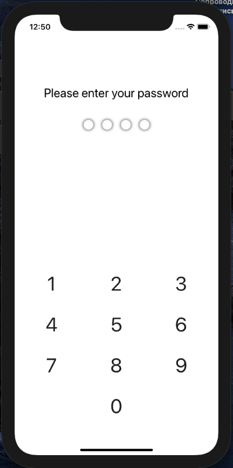
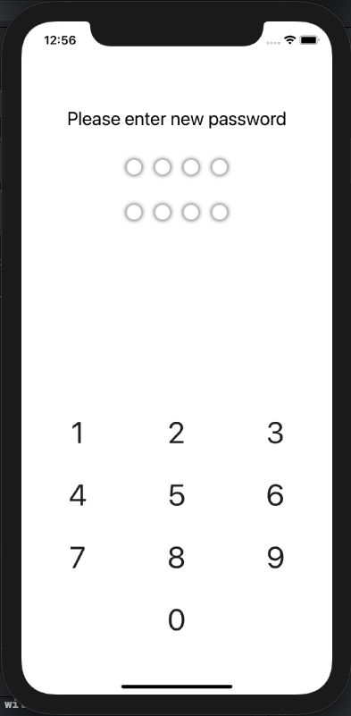
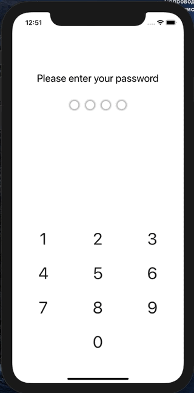
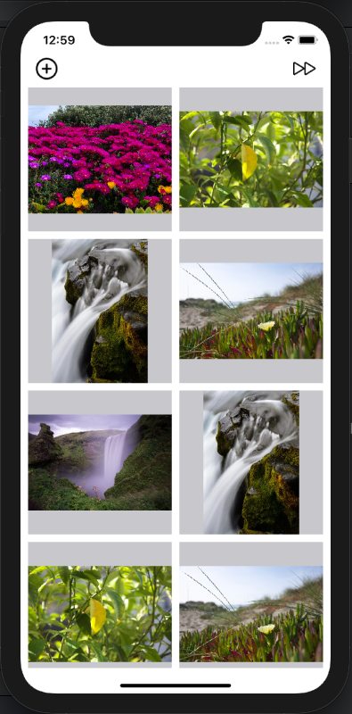
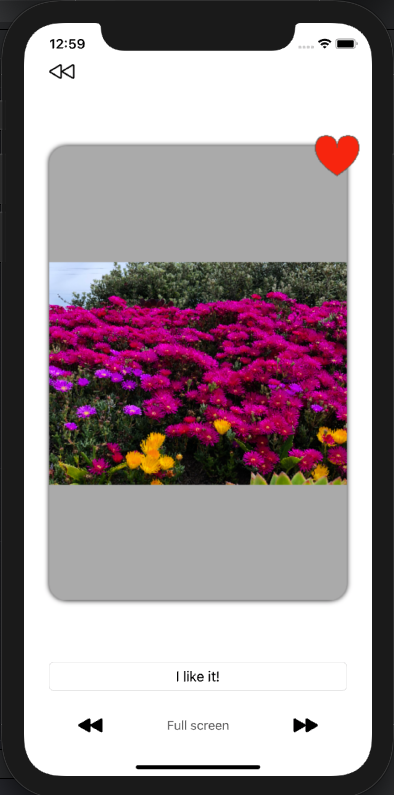

# SecretGellery
___
## Оглавление
- **[Описание](#Description)**
- **[Презентация](#Presentation)**
- **[В планах сделать](#ToDo)**

## Описание
Приложение для безопасного хранения картинок. Учебный проект.

- Проект написан на **UIKit**
- Использована стандартная архитектура **MVC**
- Верстка интерфейса **Кодом + Storyboard**
- Анимация листания картинок **UIView.animate**
- Хранение пароля **KeyChain**
- Хранение картинок **FileManager**, **UserDefaults(Codable)** 
- Экран предпоказа основан на **Collection View** 
- Навигация реализована через **Navigation Controller**

___

## Презентация
### Экран ввода пароля

### Экран выбора изображения

### Экран результатов

### Основной экран

___

## В планах сделать:
1. Поправить дизайн
